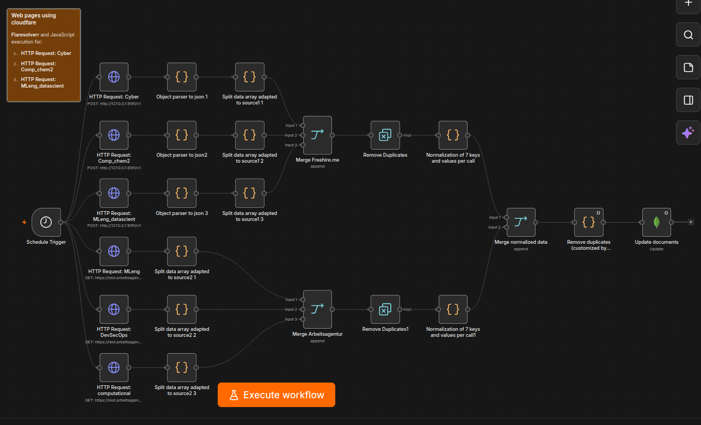

# web-search-stack



Web search automation stack using docker as a container and gluetun as 
the VPN gateway for the n8n workflow that retrieves the information in
 a database in mongoDB.

The containerized pipeline uses as example a scrapping for multiple job
 boards for tech and scientific positions in Germany.
The workflow filters and deduplicates results, and stores them in a
 local database.

The entire stack runs behind a VPN tunnel to avoid IP-based blocks from
Web Application Firewalls (WAFs) and to keep every outbound request
routed through a consistent, non-blacklisted address.

---

## 1. Requirements

### Docker and Docker Compose

You need Docker Engine and the Docker Compose plugin installed on a
Linux host.

- Official installation instructions:
  https://docs.docker.com/engine/install/
- Post-install steps (running Docker as a non-root user):
  https://docs.docker.com/engine/install/linux-postinstall/

### Why Docker should not start automatically?

By default, Docker is often enabled as a system service that starts on
boot and stays running in the background. For a project like this, that
is usually unnecessary and undesirable:

- The VPN tunnel must be established cleanly before any container
  starts. If Docker brings containers up before the VPN is ready,
  requests can leak outside the tunnel.
- A background daemon consumes resources even when you are not working
  on the project.
- If a container is misconfigured, you do not want it silently running
  for days without supervision.

To prevent Docker from starting automatically on boot, disable the
service:

    sudo systemctl disable docker

You can still start it manually when you need it:

    sudo systemctl start docker

And stop it when you are done:

    sudo systemctl stop docker

This gives you explicit control: nothing runs unless you start it
yourself.

---

## 2. VPN requirement

All outbound traffic from the containers passes through a VPN tunnel
provided by a Gluetun container, which connects to a commercial VPN
provider (for example Proton VPN via WireGuard).

### Why a VPN is required

Job boards, for instance, and their APIs are frequently protected by 
Web Application Firewalls (WAFs) such as Cloudflare or Akamai.
 These systems maintain reputation databases of IP addresses.
Requests from:

- data center IP ranges,
- cloud hosting providers,
- known automation endpoints,
- and previously flagged addresses

are often blocked outright with HTTP 403 errors, regardless of 
whether the request itself is well-formed.

By routing all container traffic through a VPN, the requests appear
to originate from a residential or otherwise unlisted address. This
significantly reduces the chance of being added to a blocklist and
keeps the workflow stable over time.

The VPN does not make the requests anonymous in a legal sense. It
changes the exit IP address so that automated access is not 
immediately rejected by the WAF.

### Using Proton VPN's free tier

If you don't have a paid Proton VPN subscription, you can use the
free tier. It supports servers in 10 countries (Netherlands, 
Japan, Romania, Poland, Norway, Switzerland, Singapore, Mexico, 
Canada, and the United States) with unlimited bandwidth.

To enable it in `docker-compose.yml`:

1. Comment out the `WIREGUARD_PRIVATE_KEY` line.
2. Uncomment the `FREE_ONLY=on` line.

Gluetun will then select a free-tier server automatically.

Note: The free tier allows only one simultaneous connection. 
If you are already connected on another device, Gluetun may fail to 
establish its tunnel.

For details, see the official Proton VPN free plan documentation: 
[https://protonvpn.com/support/proton-vpn-plans](https://protonvpn.com/support/proton-vpn-plans)

---

## 3. Container structure

The project is built from four containers. One of them acts as the
network gateway for the others.

```
    Host machine
         |
         v
    +-----------------------------------+
    |            Docker                 |
    |                                   |
    |   +---------------------------+   |
    |   |  gluetun (VPN gateway)    |   |
    |   |  Acts as the router for   |   |
    |   |  every other container.   |   |
    |   +-------------+-------------+   |
    |                 |                 |
    |     +-----------+                 |
    |     |                             |
    |     v                             |
    |  +-------+            +---------+ |
    |  |  n8n  |----------->| MongoDB | |
    |  |       |            |         | |
    |  +---+---+            +---------+ |
    |      |  (MongoDB is isolated)     |
    |      |  (calls, only when needed) |
    |      v                            |
    |  +-------------+                  |
    |  | FlareSolverr|                  |
    |  +-------------+                  |
    +-----------------------------------+
```

### How to read this diagram

- The gluetun container establishes the VPN tunnel. All other
  containers share its network namespace, so their traffic goes
  through the tunnel.
- The n8n container holds all workflows. It is the only component that
  makes outbound requests to job boards and APIs.
- The MongoDB container stores the collected job data. It is reached
  only by n8n, never directly from the host.
- The FlareSolverr (under construction) container is an optional 
  fallback. It is used only when a specific website returns a 
  JavaScript challenge (for example, a Cloudflare "Just a moment" page)
  that a plain HTTP request cannot pass.
- Because n8n, MongoDB, and FlareSolverr all share the gluetun network
  namespace, they communicate with each other over the loopback address
  (127.0.0.1) rather than through a separate Docker bridge network.

### Dependencies

All components are pulled automatically by Docker Compose. 
No manual installation of `MongoDB`, `FlareSolverr`, `Gluetun`, or `n8n`
 is required beyond having Docker and Docker Compose installed.

- `Gluetun` acts as the network gateway. It is the only container that 
connects directly to the VPN provider.
- `n8n` runs as the workflow engine. It uses the official Docker image
 and persists data in a named volume.
- `MongoDB` runs as a separate container. The `mongo:7` image is pinned in
 the compose file to avoid a known incompatibility between `MongoDB 8.x`
  and `Linux kernel 6.19+`.
- `FlareSolverr` runs only when a workflow needs to pass a 
 ***Cloudflare challenge***. It is optional and can be removed if no
  source requires it.

### Further documentation

- n8n self-hosting: [https://docs.n8n.io/deploy/host-n8n/](https://docs.n8n.io/deploy/host-n8n/)
- Gluetun: [https://github.com/passteque/gluetun](https://github.com/passteque/gluetun)
- FlareSolverr: [https://github.com/FlareSolverr/FlareSolverr](https://github.com/FlareSolverr/FlareSolverr)
- MongoDB Docker: [https://hub.docker.com/\_/mongo](https://hub.docker.com/\_/mongo)

---

## 4. Repository structure
```
    project-root/
    |
    +-- README.md                  (this file)
    +-- docker-compose.yml         (defines all four containers)
    +-- .env                       (secrets: VPN key, not committed)
    +-- .env.example               (template showing required variables)
    +-- .gitignore                 (excludes .env and local data)
    |
   +-- workflows/                 (exported n8n workflow files)
        |
        +-- README_n8n.md              (describes the workflow logic)
        +-- web-search-pipeline.json
```

### Where to start

1. Read this file to understand the overall architecture.
2. Open `docker-compose.yml` to see how each container is configured,
   which environment variables it needs, and how the network sharing
   is set up.
3. Copy `.env.example` to `.env` and fill in your own WireGuard private
   key and any other secrets.
4. Read `workflows/README.md` to understand what each workflow does.
5. Start the stack with `docker compose up -d`.

---

## 5. What is not committed

The `.env` file contains secrets and is excluded from version control.
It should contain at minimum:

- `WIREGUARD_PRIVATE_KEY` (from your VPN provider's WireGuard
  configuration)

If you later add authentication to MongoDB, the credentials also belong
in `.env`.

Never commit `.env` to a public or shared repository. If a secret is
ever exposed, rotate it immediately at the provider
